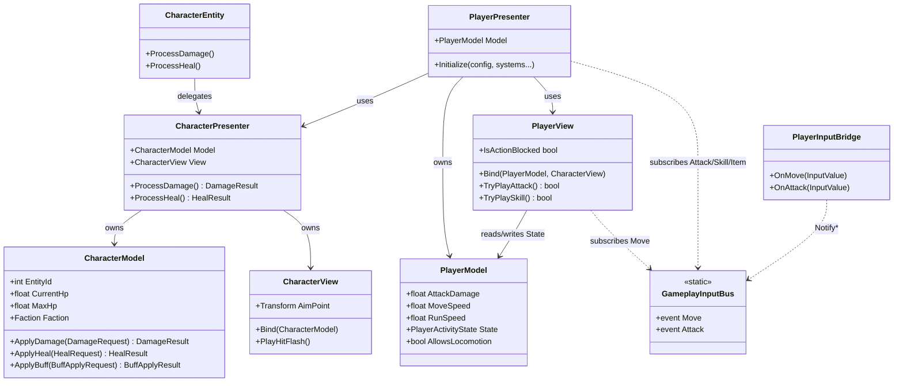
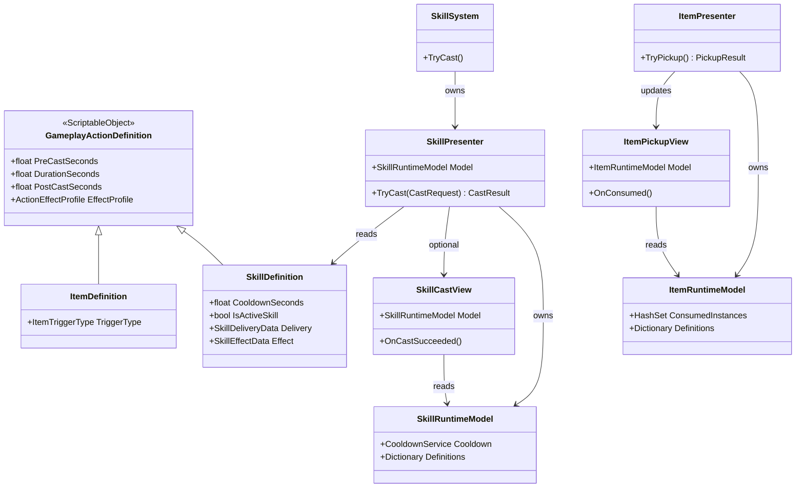
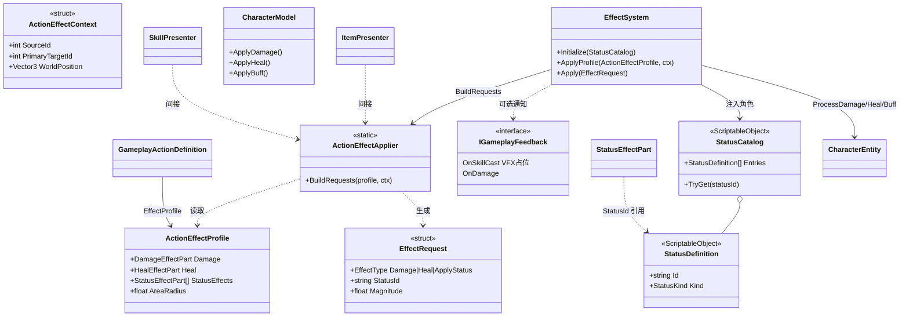
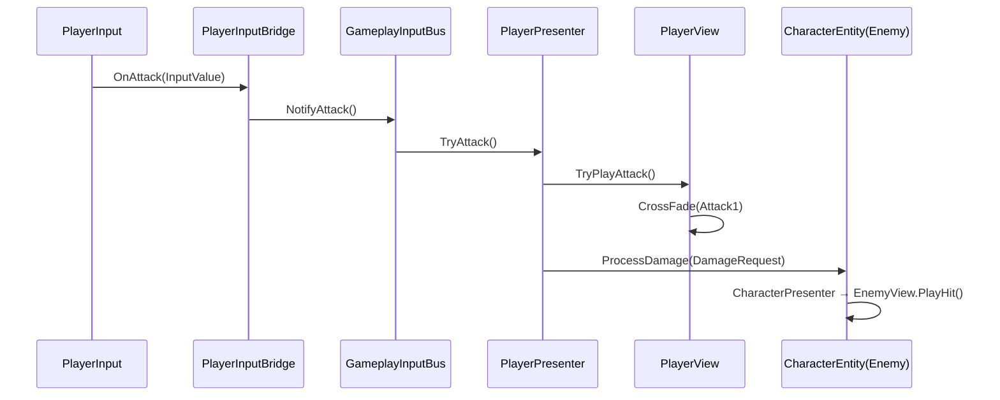
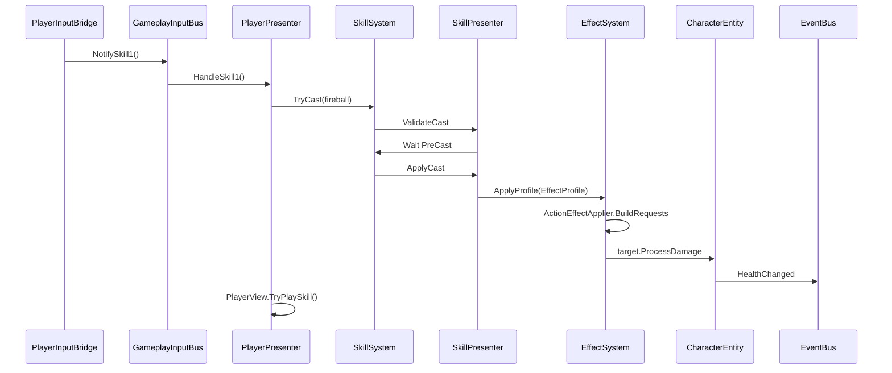
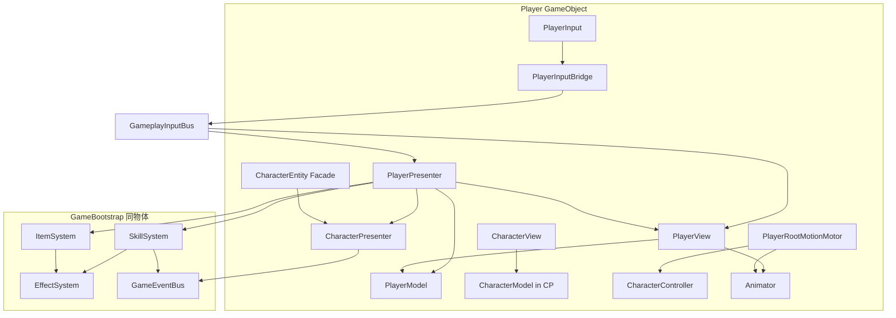

# 程序架构说明

> 当前实现状态对照：[TASK_BACKLOG.md](./TASK_BACKLOG.md)  
> 策划契约：[SYSTEM_DESIGN.md](./SYSTEM_DESIGN.md) | I/O：[SYSTEM_IO_CONVENTION.md](./SYSTEM_IO_CONVENTION.md)

## 1. 架构风格

采用 **MVP（Model – View – Presenter）** 拆分：

| 层 | 职责 | 禁止 |
|----|------|------|
| **Model** | 纯数据、规则、配置引用（ScriptableObject 为静态配置）；与渲染无关 | 引用 `Transform` / `Renderer` |
| **View** | 视觉表现、Animator 驱动、仅 View 层状态（闪色时长等）；**可读取 Model** | 修改核心规则（应经 Presenter） |
| **Presenter** | 协调 Model 与 View；对接 Effect / EventBus / Input | 直接操作 UI 画布 |

对外保留 **Facade**（如 `CharacterEntity`、`SkillSystem`）以减少跨系统耦合。

配置数据（技能/道具数值）使用 **ScriptableObject**，位于 `Assets/Data/`，归属 Model 层数据源。

### 配置表（技能 / 道具）

- **技能**：`SkillData`（`Assets/Data/Skills/`），含 `Kind`（Projectile / Channeled / StatusApply）、阶段时间、冷却、`Delivery` + `Effect` 子 SO。
- **道具**：`ItemDefinition`（`Assets/Data/Items/`），**瞬时效果**，无施法阶段；`TriggerType` 区分 OnPickup / OnUse。
- **共用**：`ActionEffectProfile`（伤害 / 治疗 / 状态 / 范围）。

快捷键由 **Loadout 槽位 index** 决定（Skill1–3 / Item1–3），配置在 `GameplaySessionConfig.asset`。

扩展步骤见 [GUIDE_ADD_SKILL_ITEM.md](./GUIDE_ADD_SKILL_ITEM.md)。

### 输入链路（当前）

```text
Input System (Assets/Input/GameInput.inputactions)
  → PlayerInput（Player Prefab，NotificationBehavior = Send Messages）
  → PlayerInputBridge（OnMove / OnAttack / OnSkill* / OnItem*）
  → GameplayInputBus（static 事件：Move / Attack / Skill1-3 / Item1-3）
  ├─ Move  → PlayerView（locomotion + Animator BlendTree）
  └─ 其余 → PlayerPresenter（普攻 / 技能 / 道具）
       → enemy.ProcessDamage / SkillSystem.TryCast / ItemSystem.TryUse
```

**8 种行动**（见 `GameInputActions`）：`Move`、`Attack`、`Skill1-3`、`Item1-3`。默认键位见 `docs/systems/Input/DATA.md`。

`GameInputReader` 为**可选测试适配器**（可向 Bus 灌输入）；可挂于 `GameBootstrap` 同物体，未配置 `InputActionAsset` 时不激活，**运行时以 PlayerInput + Bridge 为准**。

道具拾取走 **WorldInteraction**（拾取时入账次数）；**4/5/6** 从快捷栏消耗次数使用。

### 玩家 3C（Character / Camera / Control）

基础 3C 已在 **`Assets/Scenes/Main.unity`** 跑通：角色 Root Motion 位移、Cinemachine 跟随镜头、Input System 驱动移动与战斗。

```text
Control（输入）
  PlayerInput（Send Messages）
    → PlayerInputBridge → GameplayInputBus
    ├─ Move  → PlayerView（相机相对 BlendTree + TurnSpeed）
    └─ Attack/Skill/Item → PlayerPresenter

Character（角色）
  Player.prefab 实例
    → Animator（Apply Root Motion）+ PlayerRootMotionMotor
    → CharacterController.Move / deltaRotation
    → PlayerView / PlayerPresenter / CharacterEntity

Camera（镜头）
  Main Camera：Camera + CinemachineBrain + URP Additional Camera Data
  Virtual Camera：CinemachineVirtualCamera
    Body = Cinemachine3rdPersonFollow
    Follow = Player 根 Transform
    → Brain 输出到 Main Camera（Tag: MainCamera）
  PlayerView 转向读 Camera.main.forward/right（_camera 未绑时）
```

| 模块 | 职责 |
|------|------|
| `PlayerModel` | `MoveSpeed` / `RunSpeed`（暂硬编码）、`PlayerActivityState`、`AttackDamage` |
| `PlayerView` | 订阅 `Bus.Move`；线速度 / 转向 → BlendTree 参数；动作 `PlayAnimation`；`OnFinish` 回 `Walk` |
| `PlayerRootMotionMotor` | `OnAnimatorMove` → `CharacterController.Move` + `deltaRotation` |
| `PlayerPresenter` | 战斗输入；普攻对 **敌人** `ProcessDamage` |
| **Cinemachine** | 场景内 `Virtual Camera` 跟随玩家；**非**代码 `GameplayCameraRig` |

包依赖：`com.unity.cinemachine` **2.10.7**（`Packages/manifest.json`）。  
场景与 Prefab 接线详见 [systems/Character/Player/DATA.md](./systems/Character/Player/DATA.md#main-unity-场景-3c)。

> **`GameplayCameraRig`**（Bootstrap 下旧脚本）：Editor `GameplaySceneSetup` 生成俯视角 Prefab 用；**Main 场景运行时不用**，已由 Cinemachine 替代。

### 玩家移动与动画（当前）

| 模块 | 职责 |
|------|------|
| `PlayerModel` | `MoveSpeed` / `RunSpeed`（暂硬编码）、`PlayerActivityState`、`AttackDamage` |
| `PlayerView` | 订阅 `Bus.Move`；线速度 / 转向 → BlendTree 参数；动作统一 `PlayAnimation`；`OnFinish` 单次态结束回 `Walk` |
| `PlayerRootMotionMotor` | `OnAnimatorMove` → `CharacterController.Move` + `deltaRotation` |
| `PlayerPresenter` | 战斗输入；普攻时对 **敌人** `CharacterEntity.ProcessDamage`（非自身 Presenter） |

动画约定见 [systems/Character/ANIMATION.md](./systems/Character/ANIMATION.md)。**无**共享 `CharacterAnimatorDriver`；仅 Player 使用纯代码 Animator 驱动。

### 场景 Bootstrap（当前）

初始化分三批，由 `DefaultExecutionOrder` 与 Unity 生命周期控制：

| 阶段 | ExecutionOrder | 内容 |
|------|----------------|------|
| Awake | **-1100** `GameplayDataProvider` | `Resolve()` 加载 SO 配置 |
| Awake | **0**（默认） | 场景 Player / Enemy / Pickup、`EffectSystem`/`ItemSystem`/`SkillSystem` 自身 `Awake` |
| OnEnable | — | `PlayerPresenter` 订阅输入与会话；UI 订阅 `Ready` |
| Start | **100** `GameBootstrap` | 系统 `Initialize` 链 → Player 接线 → `GameplayMvpSession.Publish` |
| Start | **-900** `GameplayUiBootstrap` | 若 `IsReady` 或收到 `Ready` 事件 → HUD Bind |

`GameBootstrap` 同物体挂载 **EffectSystem / ItemSystem / SkillSystem / GameplayFeedbackProvider**；子物体 `DebugTest` 挂 `GameplaySelfTestRunner`。Editor：**Tools → Gameplay → Ensure Scene Bootstrap** 可补齐组件。

1. `EffectSystem.Initialize` → `ItemSystem` → `SkillSystem`（依赖链）  
2. `PlayerController.Initialize`、 `PickupItem.AssignItemSystem`  
3. `GameplayMvpSession.Publish`  
4. **不再** `Instantiate(GameplaySystems.prefab)`  

Player / Enemy / HUD 由 Main 场景 Inspector 引用；唯一 Canvas + Panel 切换见 FeedbackUI 文档。

### 状态表

`StatusCatalog`（`Assets/Data/Statuses/`）登记 `StatusDefinition`：`Id`、`Kind`、显示名。技能/道具的 `StatusEffects[].StatusId` 引用该表，由 `CharacterModel` 按 `Kind` 应用数值。

### 命名区分：Effect ≠ VFX

| 名称 | 目录/类型 | 含义 |
|------|-----------|------|
| **Effect**（本项目的 `Gameplay.Effect`） | `EffectSystem`、`ActionEffectApplier`、`EffectRequest` | **玩法结算**：伤害、治疗、施加状态（查 `StatusCatalog`） |
| **ActionEffectProfile** | 技能/道具 SO 上的 `EffectProfile` | 配置：伤害值、治疗值、`StatusId`+数值，三类可叠加 |
| **StatusCatalog / StatusDefinition** | `Assets/Data/Statuses/` | **状态表**：角色身上 Buff/减伤/移速等规则 |
| **IGameplayFeedback** | `Feedback/` | **视听反馈占位**（未来 Feel VFX/SFX），不参与数值 |

`ActionEffectApplier` 只做「配置 → `EffectRequest` 列表」转换；**不是**粒子或特效资源管理。

---

## 2. 实现状态总览（相对 TASK_BACKLOG）

### P0 — 已实现

| 任务 ID | 实现位置 | MVP |
|---------|----------|-----|
| CHR-P0-* | `Character/{Model,View,Presenter}` + `CharacterEntity` | 是 |
| PLY-P0-01 | `Character/Player/{Model,View,Presenter}` + `PlayerController` + Input/RootMotion | 是 |
| ENM-P0-01 | `Character/Enemy/{Model,View,Presenter}` + `TrainingDummyMarker` | 是 |
| SKL-P0-* | `Skill/{Model,View,Presenter}` + `CooldownService` | 是 |
| ITM-P0-01 | `Item/{Model,View,Presenter}` + `ItemPickupView` | 是 |
| EFT/EVT/INP/UI/DBG/DLV | 见 `Assets/Scripts/Gameplay/` 对应目录 | 部分无 MVP |

### P1 / P2 — 部分完成

| 任务 | 状态 |
|------|------|
| P2-CHR-02 玩家 locomotion + 战斗动画 | **部分完成**：`Walk` BlendTree、`Attack1`、`PlayAnimation`/`OnFinish`、**Main 场景 Cinemachine 3C**；连招待接 |
| P2-CHR-01 敌人受击/死亡动画 | **部分完成**：`EnemyView.CrossFade` |
| SKL-P1-01 改 SO 即生效 | 已支持（改 `Fireball.asset`） |
| FDB-P1-01 伤害反馈 | **部分完成**：Damage Numbers Pro（`Red Glow`）+ DPS 面板；Feel MMF 未接 |

---

## 3. 目录结构

```text
Assets/Scripts/Gameplay/
  Bootstrap/
    GameBootstrap.cs              # 实例化 Systems + 场景引用 Initialize
    GameplayDataProvider.cs
    GameplayCameraRig.cs          # 旧俯视角 Rig（Editor 工具用；Main 场景用 Cinemachine）
  Character/
    Model/CharacterModel.cs
    View/CharacterView.cs         # 闪色、AimPoint（无 Animator 驱动）
    Presenter/CharacterPresenter.cs
    CharacterEntity.cs          # Facade；ProcessDamage 作用于**本实体**
    Player/
      Model/PlayerModel.cs      # MoveSpeed, RunSpeed, PlayerActivityState
      View/PlayerView.cs        # Animator、Bus.Move、PlayAnimation
      View/OnFinish.cs          # 单次动作结束 → PlayAnimation
      Presenter/PlayerPresenter.cs
      PlayerInputBridge.cs        # PlayerInput Send Messages → Bus
      PlayerRootMotionMotor.cs
    PlayerController.cs
    Enemy/   Model | View | Presenter
    TrainingDummyMarker.cs
  Skill/ Item/ Effect/ Feedback/
  EventBus/ Input/ FeedbackUI/ ...
Assets/Input/GameInput.inputactions
Assets/Animation/PlayerAnimator.controller
Assets/Prefab/Player.prefab（GameplaySystems 已并入 Main 场景 GameBootstrap）
Assets/Data/  Skills/ Items/ Statuses/
```

---

## 4. UML — 类图（Character / Player 域）



---

## 5. UML — 类图（Skill / Item）



---

## 5b. UML — 类图（玩法 Effect / 状态表）



---

## 6. UML — 序列图（普攻）



> **注意**：伤害必须调用 **目标** 的 `CharacterEntity.ProcessDamage`；对玩家自身 Presenter 调用会错误触发 `PlayerView.PlayHit()`。

---

## 7. UML — 序列图（火球释放）



---

## 8. UML — 组件图（运行时）



---

## 9. 访问规则（强制）

1. **View** 通过 `Bind(model)` 持有 Model 引用；玩家移动输入由 `PlayerView` 直接订阅 Bus，`PlayerPresenter` 不处理 Move。  
2. **Presenter** 持有 Model 实例，调用 View 刷新；外部系统通过 Facade 或 Presenter 公共 API 交互。  
3. **ScriptableObject** 仅作配置，运行时状态存入 `*RuntimeModel` / `CharacterModel` / `PlayerModel.State`。  
4. **EffectSystem** 与普攻均通过 **目标** `CharacterEntity.ProcessDamage` 结算；`CharacterPresenter.ProcessDamage` 只对挂载实体扣血并播受击表现。  
5. **输入订阅**：`PlayerPresenter.BindInput` 在 `Initialize` 与 `OnEnable` 均会调用——实现上需避免重复订阅（见 Input 文档已知问题）。

---

## 10. 相关文档

- [systems/Character/MVP.md](./systems/Character/MVP.md)
- [systems/Character/Player/SYSTEM.md](./systems/Character/Player/SYSTEM.md)
- [systems/Character/ANIMATION.md](./systems/Character/ANIMATION.md)
- [systems/Input/DATA.md](./systems/Input/DATA.md)
- [systems/Skill/MVP.md](./systems/Skill/MVP.md)
- [systems/Item/MVP.md](./systems/Item/MVP.md)
