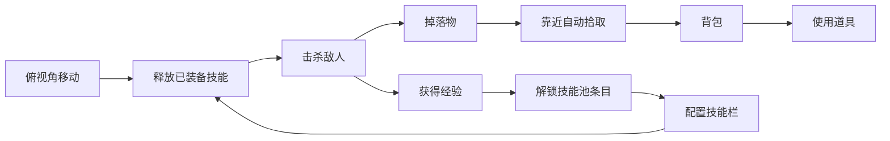

# 游戏核心策划

## 一句话定位

俯视角 **类暗黑破坏神（Diablo-like）战斗 Demo**：清怪 → 获得经验与掉落 → 成长与配装 → 更强技能循环；技能与道具**数据驱动**（ScriptableObject），便于策划迭代。

> 仓库原始需求见 [CHALLENGE.md](../CHALLENGE.md)（训练场式可配置原型）。本 Demo 在保留「配置 + 事件 + 自测」交付能力的前提下，**产品愿景升级为 Diablo-like**；分阶段任务见 [TASK_BACKLOG.md](./TASK_BACKLOG.md)。

## 核心体验目标（完整版）

1. **战斗可读**：伤害、治疗、状态、冷却、拾取在 UI/日志可感知。
2. **成长驱动**：击杀敌人获得经验，解锁技能池中的新技能。
3. **自由配装**：玩家将已解锁技能装备到有限技能栏（类似 Diablo 技能槽）。
4. **掉落驱动**：敌人死亡掉落道具，靠近自动拾取进背包（完整版）；使用消耗品产生效果。
5. **配置即玩法**：伤害、范围、冷却、状态 ID 等改 SO 即生效。
6. **可验证**：自测覆盖配置、冷却、效果、拾取/消耗。

## 核心循环（目标态）

## 分阶段范围（摘要）

| 阶段 | 玩家可感知目标 | 刻意不做 |
|------|----------------|----------|
| **一** | 1 个非指向伤害技能 + 1 个恢复道具 + 无动画假人；能打完、能回血 | 经验、背包、掉落、配装 UI、敌人动画 |
| **二** | 更多技能/道具效果；敌人有动画；仍为简化拾取 | 经验、完整背包 |
| **三** | 经验解锁技能 + 背包 + 死亡掉落 + 技能栏配置 | 关卡、存档、复杂 AI |

任务与 DoD 详见 [TASK_BACKLOG.md](./TASK_BACKLOG.md)。

## 当前代码与愿景差距（2025-06）

| 愿景能力 | 代码现状 |
|----------|----------|
| 非指向 AOE 伤害 | 有 `Targeting.NonTargeted`，默认火球为指向性，需改配置/默认技能 |
| 恢复道具 | ✅ `heal_potion` + `EffectProfile.Heal` |
| 无动画假人 | ✅ 站桩假人（Animator 可选） |
| 击杀掉落 | ❌ 假人不死亡、无 `LootTable` |
| 靠近拾取进背包 | ⚠️ 场景固定药水 + 次数快捷栏，**非**背包 |
| 经验解锁技能 | ❌ |
| 自由配置技能栏 | ⚠️ 固定 `GameBootstrap` 装备数组 |

## 明确不做（全阶段）

- 完整关卡章节、剧情、存档云同步
- 联网、匹配
- 复杂仇恨/寻路 AI（P2 以后可做简单追击）
- 商业化数值与赛季

## 相关文档

- 分阶段任务表：[TASK_BACKLOG.md](./TASK_BACKLOG.md)
- 系统总纲：[SYSTEM_DESIGN.md](./SYSTEM_DESIGN.md)
- 程序架构：[ARCHITECTURE.md](./ARCHITECTURE.md)
- I/O 约定：[SYSTEM_IO_CONVENTION.md](./SYSTEM_IO_CONVENTION.md)
