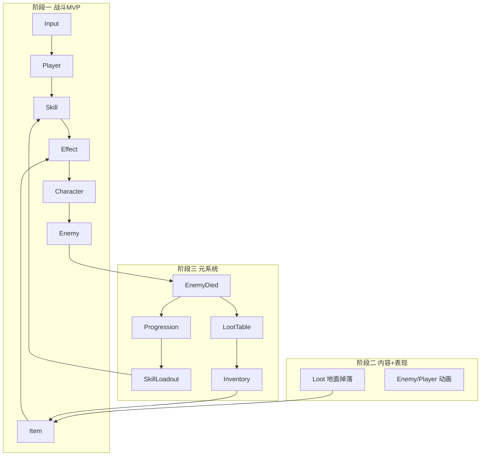

# 系统策划总纲

> 产品愿景：俯视角类 Diablo Demo。版本路线图见 [TASK_BACKLOG.md](./TASK_BACKLOG.md)。  
> 各系统详情见 `docs/systems/<SystemId>/`。  
> **试玩**：[GAME_MANUAL.md](./GAME_MANUAL.md) · **扩展内容**：[GUIDE_ADD_SKILL_ITEM.md](./GUIDE_ADD_SKILL_ITEM.md)

## 系统索引

### 已实现（战斗执行层）

| 系统 | 路径 | 摘要 |
|------|------|------|
| Character | [systems/Character/](./systems/Character/SYSTEM.md) | 生命、移动、Buff；Player / Enemy 子模块 |
| Input | [systems/Input/](./systems/Input/SYSTEM.md) | Input System → `GameplayInputBus` → PlayerPresenter |
| Skill | [systems/Skill/](./systems/Skill/SYSTEM.md) | 主动技能、冷却；[Cooldown](./systems/Skill/Cooldown/SYSTEM.md) |
| Item | [systems/Item/](./systems/Item/SYSTEM.md) | 拾取与使用（向背包演进） |
| Effect | [systems/Effect/](./systems/Effect/SYSTEM.md) | 玩法结算：伤害/治疗/状态（非 VFX） |
| Status | [systems/Status/DATA.md](./systems/Status/DATA.md) | `StatusCatalog` 状态表 |
| EventBus | [systems/EventBus/](./systems/EventBus/SYSTEM.md) | 领域事件 |
| WorldInteraction | [systems/WorldInteraction/](./systems/WorldInteraction/SYSTEM.md) | 靠近拾取（向自动拾取演进） |
| FeedbackUI | [systems/FeedbackUI/](./systems/FeedbackUI/SYSTEM.md) | HP、技能 CD、日志、DPS 面板 |
| Feedback | `GameplayFeedbackProvider` + Damage Numbers Pro | 伤害飘字（`Red Glow`） |
| DebugTest | [systems/DebugTest/](./systems/DebugTest/SYSTEM.md) | 自测 |

### 规划（元系统，阶段二/三）

| 系统 | 路径（待建） | 摘要 | 阶段 |
|------|--------------|------|------|
| **Loot** | `systems/Loot/` | 敌人死亡 → 掉落物生成、掉落表 SO | 二（链路）/ 三（表驱动） |
| **Inventory** | `systems/Inventory/` | 背包槽、自动拾取入包、使用消耗品 | 三 b（二可简化列表） |
| **Progression** | `systems/Progression/` | 经验、等级、技能解锁 | 三 a |
| **SkillLoadout** | `systems/SkillLoadout/` | 已解锁技能装备到技能栏 | 三 b |

## 目标依赖图

## 阶段与系统矩阵

| 系统 | 阶段一 | 阶段二 | 阶段三 |
|------|--------|--------|--------|
| Character / Effect / Skill / Item | 最小集 | 扩展配置 | 接 Loadout/Inventory |
| 非指向 AOE 技能 | **必做** | 更多技能 | — |
| 恢复道具 | **必做**（即时拾取） | 更多道具 | 从背包使用 |
| 假人死亡事件 | **建议** | 接掉落 | 接经验 |
| 敌人动画 | 不做 | **必做** | — |
| 击杀掉落 | 不做 | **建议简化** | 完整掉落表 |
| 经验/解锁 | 不做 | 不做 | **必做** |
| 背包 | 不做 | 简化列表可选 | **必做** |
| 技能栏配置 UI | 不做 | 不做 | **必做** |

## 数据配置（跨阶段）

| 数据 | 路径 | 说明 |
|------|------|------|
| 技能 | `Assets/Data/Skills/` | `SkillDefinition` + `EffectProfile` |
| 道具 | `Assets/Data/Items/` | `ItemDefinition` |
| 状态 | `Assets/Data/Statuses/` | `StatusCatalog` |
| 掉落表 | `Assets/Data/Loot/`（规划） | `LootTableDefinition` per 敌人 |
| 成长 | `Assets/Data/Progression/`（规划） | `XpCurve`、`SkillUnlockTable` |

## 默认内容演进

| id | 阶段一 | 完整版角色 |
|----|--------|------------|
| `nova`（非指向 AOE 伤害） | 主战斗技能 | 技能池 |
| `heal_potion` | 地面即时治疗 | 背包消耗品 |
| `fireball` / `shield` | 可降级/移除或阶段二加入 | 可选技能池成员 |
| 敌人 `training_dummy` | 无动画假人 | 可替换为可掉落敌人 |

## 相关文档

- [GAME_CORE.md](./GAME_CORE.md)
- [ARCHITECTURE.md](./ARCHITECTURE.md)
- [TASK_BACKLOG.md](./TASK_BACKLOG.md)
- [SYSTEM_IO_CONVENTION.md](./SYSTEM_IO_CONVENTION.md)
